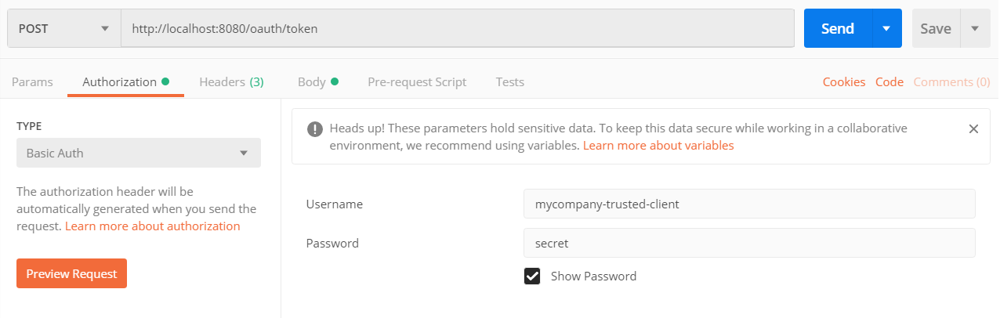
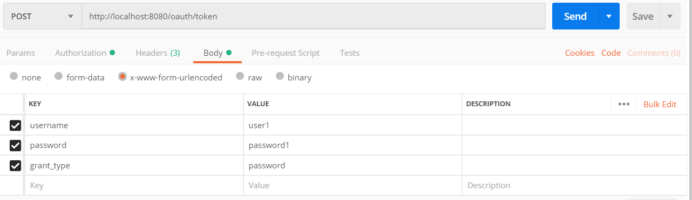
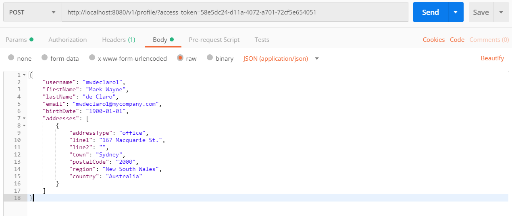
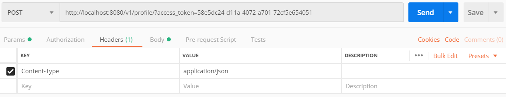
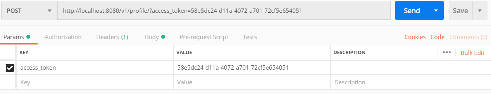

# User Profile Management
An API for User Profile Management

This project has a built-in Oauth Authentication server  that should then be utilized to access the APIs.

#### Get token from Authentication Server

Launch POSTMAN to generate TOKEN

    
    
    

    

#### Simple Post Call

This will require the access token generated from the step above

    

    
    
    
    
